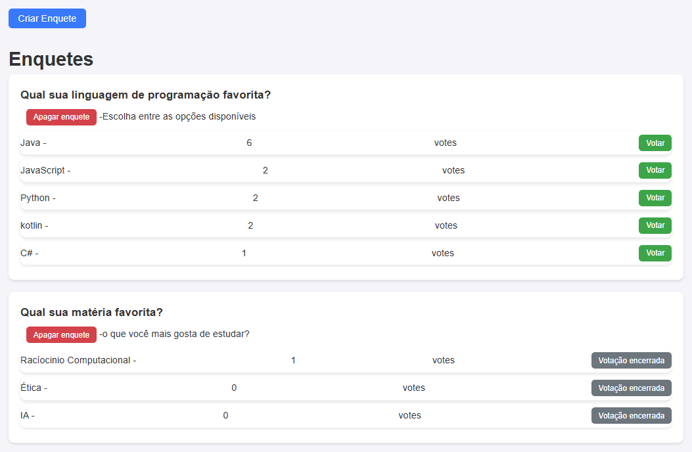
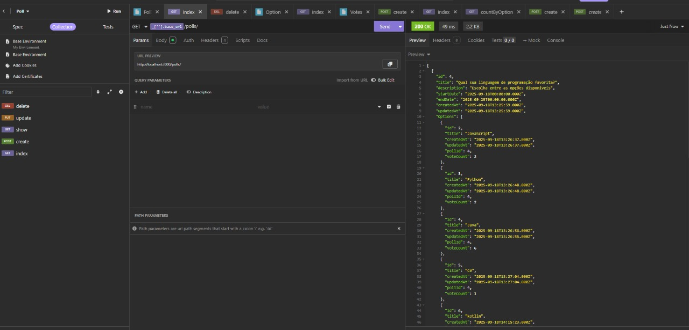

# 📊 Polls (Enquetes)

Projeto simples de enquetes com **Node.js (Express + Sequelize + MySQL)** no backend e **HTML + JavaScript** no frontend.

## ✨ Funcionalidades
- Criar enquetes (título, descrição, data de início e fim)
- Criar opções vinculadas à enquete
- Listar enquetes com opções e contagem de votos
- Votar em opções (validação de período ativo)
- Apagar enquetes
- Frontend consumindo a API com **fetch**

---

## 🚀 Tecnologias
- **Backend:** Node.js, Express, Sequelize, MySQL2, CORS
- **Frontend:** HTML, CSS, JavaScript
- **Banco:** MySQL

---

## ⚙️ Pré-requisitos
- Node.js (v16+ recomendado)
- MySQL instalado (ou container)
- NPM ou Yarn

---

## 📦 Instalação

Clone o repositório:
```bash
git clone https://github.com/seu-usuario/polls.git
cd polls
# 📊 Polls (Enquetes)

Projeto simples de enquetes com **Node.js (Express + Sequelize + MySQL)** no backend e **HTML + JavaScript** no frontend.

## ✨ Funcionalidades
- Criar enquetes (título, descrição, data de início e fim)
- Criar opções vinculadas à enquete
- Listar enquetes com opções e contagem de votos
- Votar em opções (validação de período ativo)
- Apagar enquetes
- Frontend consumindo a API com **fetch**

---

## 🚀 Tecnologias
- **Backend:** Node.js, Express, Sequelize, MySQL2, CORS
- **Frontend:** HTML, CSS, JavaScript
- **Banco:** MySQL

---

## ⚙️ Pré-requisitos
- Node.js (v16+ recomendado)
- MySQL instalado (ou container)
- NPM ou Yarn

---

## 📦 Instalação

Clone o repositório:
```bash
git clone
cd polls

# Instalar dependências
npm install
npm install mysql2

# Criar banco de dados
CREATE DATABASE estagio_nodejs CHARACTER SET utf8mb4 COLLATE utf8mb4_unicode_ci;

Crie um .env na raiz do projeto com as seguintes informações:
DB_HOST=localhost
DB_PORT=3306
DB_USER=root
DB_PASS=sua_senha
DB_NAME=estagio_nodejs
PORT=3000

## ▶️ Rodando o Backend
npm run dev
# Servidor rodando em http://localhost:3000


## 💻 Rodando o Frontend
Abra o arquivo `frontend/index.html` no navegador
ou use a extensão Live Server no VSCode

## 📸 Prints do Projeto

<p align="center">
  
  
</p>


